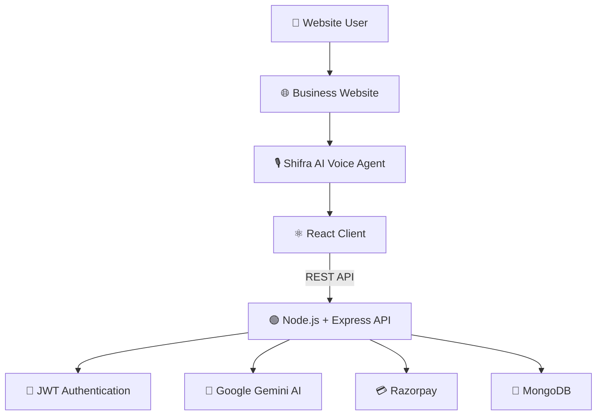
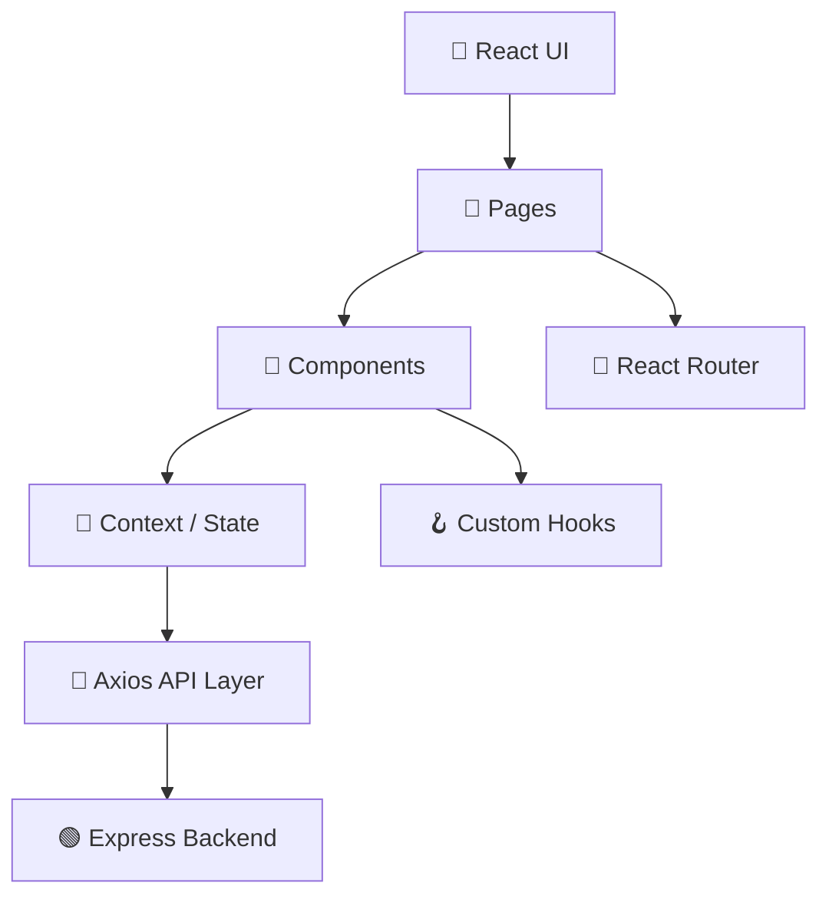
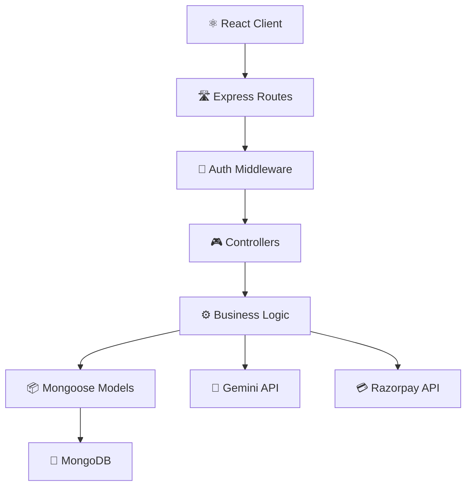
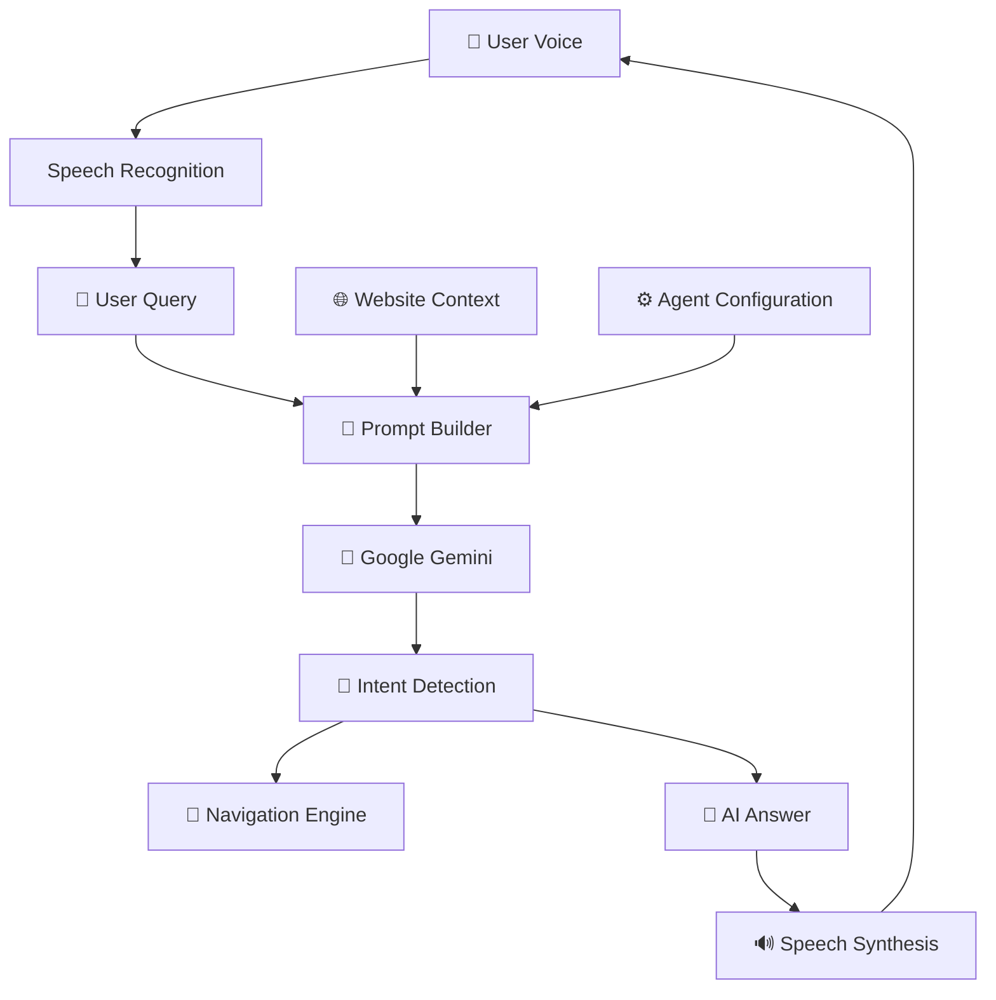
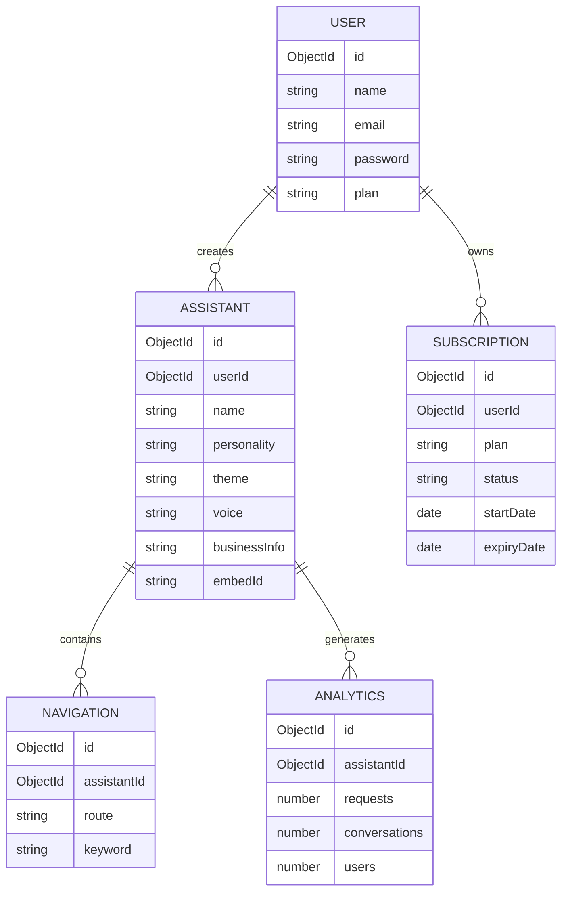

<p align="center">
  
</p>

<p align="center">
  
</p>

<p align="center">
  
  
  
  
</p>

<p align="center">
  <strong>Build. Customize. Deploy. Your AI Voice Agent.</strong>
</p>

<p align="center">
  A modern AI Voice Agent Builder Platform that allows businesses to create,
  customize and deploy intelligent voice assistants on any website.
</p>

<p align="center">
  <a href="https://your-live-demo.com">🌐 Live Demo</a>
  &nbsp; • &nbsp;
  <a href="#-features">✨ Features</a>
  &nbsp; • &nbsp;
  <a href="#-architecture">🏗 Architecture</a>
  &nbsp; • &nbsp;
  <a href="#-installation">⚡ Installation</a>
</p>

# 📸 Screenshots & Preview


## 🧠 What is Shifra AI?

**Shifra AI** is a SaaS-style **AI Voice Agent Builder** designed for businesses that want to add conversational AI to their websites without building an AI assistant from scratch.

With Shifra AI, a business can:

```text
Create Assistant
      ↓
Customize Personality
      ↓
Configure Website Knowledge
      ↓
Configure Voice
      ↓
Configure Navigation
      ↓
Generate Embed Script
      ↓
Paste Script Into Website
      ↓
🎙️ AI Voice Agent Goes Live
```

The goal is simple:

> **Turn any website into an intelligent, voice-enabled experience.**

---


## 🚀 Why Shifra AI?

Traditional websites make users:

```text
Search → Click → Read → Search Again → Navigate
```

Shifra AI changes that experience:

```text
User
  ↓
🎙️ "Open pricing"
  ↓
AI understands the request
  ↓
AI responds naturally
  ↓
Website navigates automatically
```

### Businesses can use Shifra AI for:

* 🛍️ E-commerce websites
* 🍔 Food delivery platforms
* 🏨 Hotels
* 🏥 Healthcare websites
* 🎓 Education platforms
* 💼 SaaS products
* 🏢 Business websites
* 🛒 Online stores
* 📞 Customer support
* 📚 Knowledge-based websites

---

## ✨ Core Features

### 🤖 AI Voice Agent

* Google Gemini AI integration
* Natural language conversations
* AI question answering
* Website-aware responses
* Context-aware conversations
* Fast AI responses
* Natural voice interaction

---

### 🎙️ Voice Interaction

```text
🎤 User speaks
       ↓
Speech Recognition
       ↓
Speech → Text
       ↓
AI Processing
       ↓
Google Gemini
       ↓
AI Response
       ↓
Text → Speech
       ↓
🔊 User hears response
```

**Voice capabilities**

* 🎤 Speech recognition
* 🔊 Speech synthesis
* 🎙️ Hands-free conversations
* 🌊 Animated voice waveform
* 👂 Listening state
* 🗣️ Speaking state
* ⏹️ Start / stop voice control
* ⚡ Real-time interaction

---

## 🌐 Intelligent Website Navigation

Shifra AI is not only a chatbot.
The agent can interact with the website's navigation system.

### Example

```text
User:
"Open billing"
        ↓
Speech Recognition
        ↓
AI / Navigation Engine
        ↓
Keyword Matching
        ↓
/billing
        ↓
React Router
        ↓
Billing Page
```

### Supported navigation

* Dynamic routes
* Custom keywords
* Page detection
* Route matching
* Voice navigation
* Context-aware navigation

---

## 🎨 AI Agent Builder

Businesses can customize their assistant without changing the application code.

### Configuration

| Configuration     | Description          |
| ----------------- | -------------------- |
| 🤖 Assistant Name | Custom AI name       |
| 🏢 Business Info  | Business knowledge   |
| 🧠 Personality    | AI behavior          |
| 🎨 Theme          | Assistant appearance |
| 🎙️ Voice          | Voice configuration  |
| 🌐 Navigation     | Website routes       |
| 🔑 Keywords       | Navigation triggers  |
| 📜 Embed Script   | Website integration  |

---

## ⚡ One Script Deployment

The biggest advantage of Shifra AI is simple deployment.

A business receives an embed script:

```html
<script
  src="[https://your-domain.com/shifra-agent.js](https://your-domain.com/shifra-agent.js)"
  data-agent-id="YOUR_AGENT_ID">
</script>
```

Paste it into any website:

```text
Website
   │
   ├── Existing Website
   │
   └── Shifra AI Script
              │
              ▼
       🎙️ Voice Assistant
```

No major frontend rewrite is required.

---

## 💳 SaaS Billing

Shifra AI includes subscription management using Razorpay.

### Payment flow

```text
User
 │
 ▼
Choose Plan
 │
 ▼
Create Razorpay Order
 │
 ▼
Razorpay Checkout
 │
 ▼
Payment Completed
 │
 ▼
Signature Verification
 │
 ▼
Backend Validation
 │
 ▼
Update Subscription
 │
 ▼
🎉 Pro Activated
```

### Billing features

* Razorpay integration
* Pro subscription
* Payment verification
* Subscription status
* Plan management
* Expiry handling
* Protected premium features

---

## 🔐 Secure Authentication

```text
Login / Register
       ↓
Credentials Validation
       ↓
JWT Generation
       ↓
HTTP-Only Cookie
       ↓
Authentication Middleware
       ↓
Protected API
       ↓
Dashboard
```

### Security features

* JWT authentication
* HTTP-only cookies
* Protected routes
* Public routes
* Authentication middleware
* Session persistence
* Backend authorization

---

## 🏗️ Architecture

### 🌐 High-Level System Architecture



---

### 🧩 Complete AI Voice Architecture

```mermaid
flowchart LR
    User["🎤 User"]
    Speech["🗣️ Speech Recognition"]
    Text["📝 Speech to Text"]
    API["⚡ Express API"]
    Prompt["🧠 AI Prompt Engine"]
    Gemini["🤖 Google Gemini"]
    Response["💬 AI Response"]
    TTS["🔊 Speech Synthesis"]
    User2["👤 User Hears Response"]

    User --> Speech
    Speech --> Text
    Text --> API
    API --> Prompt
    Prompt --> Gemini
    Gemini --> Response
    Response --> TTS
    TTS --> User2
```



---

### ⚛️ Frontend Architecture



---

### ⚙️ Backend Architecture

Shifra AI follows a clean **MVC-style backend architecture**.



---

### 🧱 Backend Request Lifecycle

```text
HTTP Request
     │
     ▼
Express Router
     │
     ▼
Authentication Middleware
     │
     ▼
Controller
     │
     ▼
Business Logic
     │
     ├──────────────┐
     ▼              ▼
MongoDB          External APIs
                    │
             ┌─────┴─────┐
             ▼           ▼
          Gemini      Razorpay
             │           │
             └─────┬─────┘
                   ▼
             Controller
                   │
                   ▼
             JSON Response
```

---

### 🤖 AI Processing Architecture



---

### 🗂️ Database Architecture



---

### 📊 Platform Architecture

```text
                    SHIFRA AI PLATFORM
                           │
        ┌──────────────────┼──────────────────┐
        │                  │                  │
        ▼                  ▼                  ▼
   👤 Businesses      🎙️ Voice Agent      🌐 Website
        │                  │                  │
        ▼                  ▼                  ▼
   Dashboard          Gemini AI          Embed Script
        │                  │                  │
        └──────────────────┼──────────────────┘
                           │
                           ▼
                    🟢 Express API
                           │
              ┌────────────┼────────────┐
              ▼            ▼            ▼
          🍃 MongoDB    💳 Razorpay   🔐 JWT
```

---

## 📂 Project Structure

```text
Shifra-AI/
│
├── client/
│   │
│   ├── public/
│   │
│   └── src/
│       ├── assets/
│       ├── components/
│       ├── context/
│       ├── pages/
│       ├── hooks/
│       ├── utils/
│       ├── services/
│       ├── App.jsx
│       └── main.jsx
│
├── server/
│   │
│   ├── configs/
│   ├── controllers/
│   ├── middleware/
│   ├── models/
│   ├── routes/
│   ├── services/
│   ├── utils/
│   ├── app.js
│   └── server.js
│
├── README.md
└── package.json
```

---

## 🛠️ Tech Stack

<div align="center">

### Frontend


### Backend


### AI & Services

<br/>


### Deployment


</div>

---

## 🧰 Development Stack

| Layer                  | Technology    |
| ---------------------- | ------------- |
| 🎨 Frontend            | React         |
| 🧭 Routing             | React Router  |
| 🎨 Styling             | Tailwind CSS  |
| 📡 API                 | Axios         |
| 🟢 Backend             | Node.js       |
| 🚀 Framework           | Express.js    |
| 🍃 Database            | MongoDB       |
| 📦 ODM                 | Mongoose      |
| 🔐 Authentication      | JWT           |
| 🤖 AI                  | Google Gemini |
| 💳 Payments            | Razorpay      |
| ☁️ Frontend Deployment | Vercel        |
| ☁️ Backend Deployment  | Render        |

---

## ⚡ Installation

### 1️⃣ Clone Repository
```bash
git clone [https://github.com/yourusername/shifra-ai.git](https://github.com/yourusername/shifra-ai.git)
cd shifra-ai
```

### 2️⃣ Install Client
```bash
cd client
npm install
```

### 3️⃣ Install Server
```bash
cd ../server
npm install
```

### 4️⃣ Start Backend
```bash
cd server
npm run dev
```

### 5️⃣ Start Frontend
```bash
cd client
npm run dev
```

---

## 🔑 Environment Variables

### Client
```env
VITE_API_URL=
VITE_CLIENT_URL=
VITE_RAZORPAY_KEY=
```

### Server
```env
PORT=5000
MONGO_URI=
JWT_SECRET=
GEMINI_API_KEY=
RAZORPAY_KEY_ID=
RAZORPAY_KEY_SECRET=
CLIENT_URL=
```

---

## 🚀 Deployment Architecture

```text
                 🌍 Internet
                     │
          ┌──────────┴──────────┐
          │                     │
          ▼                     ▼
      ▲ Vercel                Render
   React Frontend        Express Backend
          │                     │
          └──────────┬──────────┘
                     │
          ┌──────────┼──────────┐
          ▼          ▼          ▼
       MongoDB     Gemini    Razorpay
```

---

## 📈 Product Value

Shifra AI is designed around three major goals:

*   **1. 🎙️ Better User Experience:** Users can interact with websites naturally using voice.
*   **2. ⚡ Faster Navigation:** Users don't need to manually search through multiple pages.
*   **3. 🧠 Intelligent Assistance:** Gemini-powered conversations allow businesses to provide AI-based assistance 24/7.

---

## 🔮 Future Roadmap

```text
✅ AI Voice Agent
✅ Gemini Integration
✅ Website Navigation
✅ Agent Builder
✅ Razorpay Billing
✅ Authentication
✅ Embed Script

        ↓

🔜 OpenAI Support
🔜 ElevenLabs Voice
🔜 Multi-language Support
🔜 AI Memory
🔜 Conversation History
🔜 Analytics Dashboard
🔜 Team Workspace
🔜 Custom AI Avatar
🔜 Wake Word Detection
🔜 Mobile SDK
🔜 Voice Calling
```

---

## 🎯 Project Highlights

```text
┌─────────────────────────────────────────┐
│             🎙️ SHIFRA AI                │
├─────────────────────────────────────────┤
│                                         │
│  🤖 AI Powered                          │
│  🎤 Voice Enabled                       │
│  🌐 Website Integrated                  │
│  🧠 Gemini Powered                      │
│  💳 SaaS Billing                        │
│  🔐 Secure Authentication               │
│  🎨 Fully Customizable                  │
│  ⚡ Easy Embed Deployment                │
│                                         │
└─────────────────────────────────────────┘
```

---

## 🤝 Contributing

Contributions are welcome!

```bash
git checkout -b feature/amazing-feature
git add .
git commit -m "Add amazing feature"
git push origin feature/amazing-feature
```

Then open a Pull Request.

---

## ⭐ Support

If you find **Shifra AI** useful:

*   ⭐ Star the repository
*   🍴 Fork the project
*   📢 Share it with developers
*   💬 Open an issue for suggestions

<br/>

<p align="center">
  
</p>

<p align="center">

  

</p>

<p align="center">

  <a href="https://github.com/suvojitmanna">
    
  </a>

  

  

</p>

<p align="center">
  ⭐ <b>If you like Shifra AI, consider starring the repository.</b>
</p>

<p align="center">
  <sub>© 2026 Shifra AI • Built with React, Node.js, MongoDB & Google Gemini</sub>
</p>


<div align="center">

### 🎙️ Shifra AI
**Give every website a voice.**

Built with ❤️ using the **MERN Stack + Google Gemini**

⭐ **Star the repository if you like the project.**

</div>
